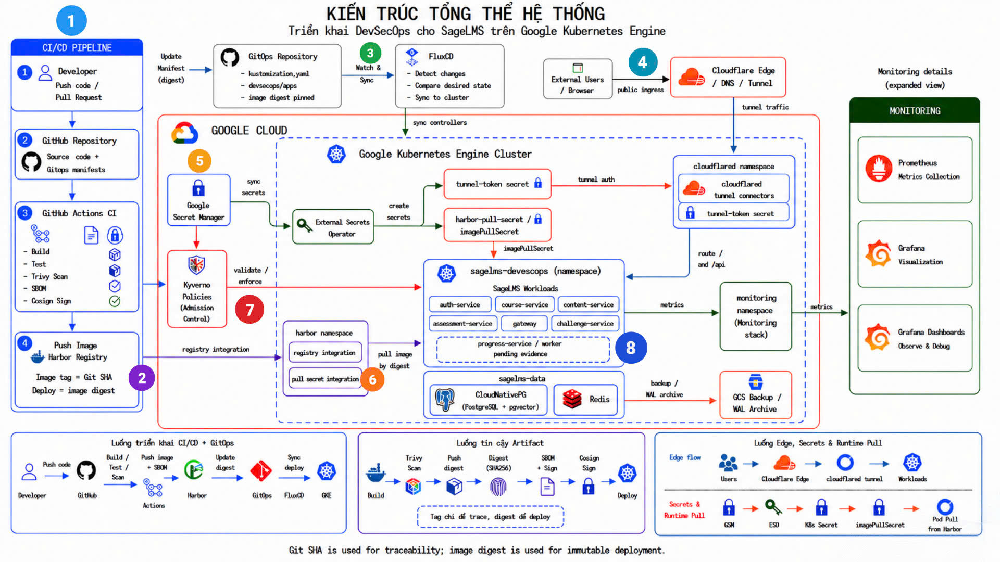
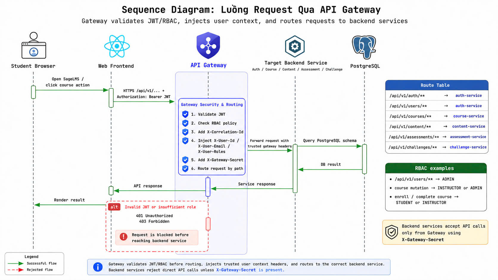
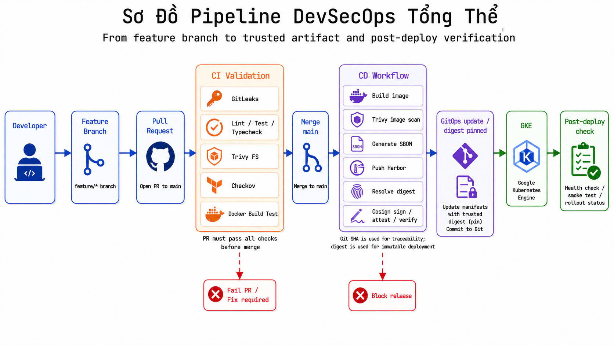
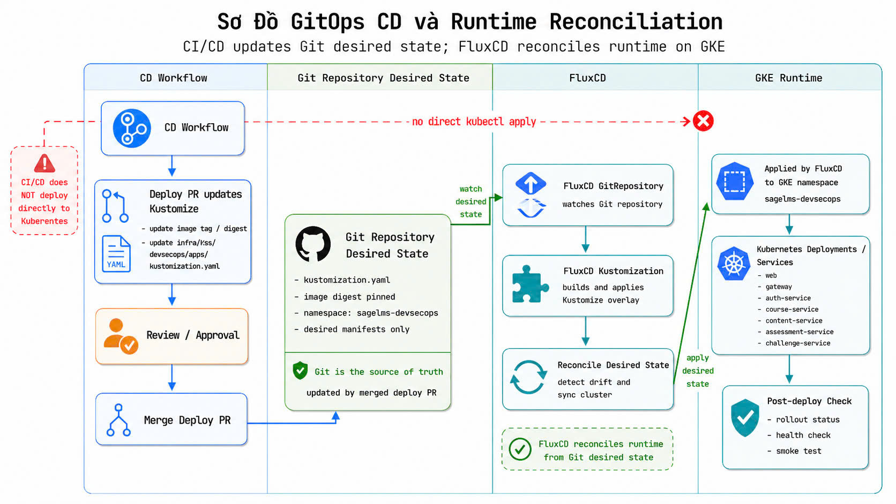
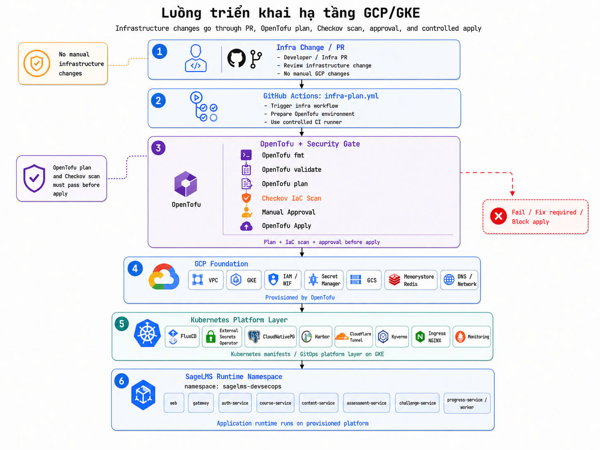

# SageLMS - AI-Powered Learning Management System

[](https://github.com/daithang59/sagelms/actions/workflows/ci-pr.yml)
[](https://sonarcloud.io/summary/new_code?id=daithang59_sagelms)

SageLMS là nền tảng quản lý học tập trực tuyến theo kiến trúc web microservices, tích hợp AI Tutor để hỗ trợ hỏi đáp theo nội dung khóa học, cá nhân hóa trải nghiệm học tập và tự động hóa một phần đánh giá.

Dự án đồng thời triển khai pipeline DevSecOps end-to-end trên GitHub Actions, Harbor, FluxCD, OpenTofu và Google Kubernetes Engine (GKE), với mục tiêu biến mã nguồn thành artifact có kiểm tra bảo mật, SBOM, chữ ký số và triển khai GitOps có thể truy vết.

[Onboarding](./docs/onboarding.md) · [Architecture](./docs/architecture/overview.md) · [Roadmap](./docs/roadmap.md) · [API Contracts](./contracts/) · [Contributing](./CONTRIBUTING.md)

---

## Mục Tiêu MVP

| Năng lực | Mô tả |
| --- | --- |
| Authentication & RBAC | Đăng ký, đăng nhập, JWT, phân quyền theo vai trò student/instructor/admin |
| Course Management | Quản lý khóa học, giảng viên, enrollment và trạng thái học tập |
| Content Delivery | Quản lý bài học, tài liệu, thứ tự nội dung và tài nguyên khóa học |
| Progress Tracking | Theo dõi tiến độ học, phần trăm hoàn thành và trạng thái từng bài học |
| Assessment & Challenge | Tạo bài kiểm tra, câu hỏi, thử thách và chấm điểm tự động |
| AI Tutor | Chatbot hỏi đáp dựa trên nội dung khóa học theo hướng RAG |
| Admin Operations | Quản lý người dùng, khóa học, phê duyệt giảng viên và vận hành hệ thống |

---

## Kiến Trúc Tổng Quan



SageLMS dùng React SPA làm giao diện web, API Gateway làm điểm vào duy nhất cho backend, và các service nghiệp vụ độc lập phía sau. Dữ liệu chính nằm trong PostgreSQL 16 với `pgvector`; Redis được dùng cho cache và tác vụ nền. Môi trường DevSecOps chạy trên GKE, image được lưu tại Harbor và triển khai qua Kustomize/FluxCD.

Nguyên tắc thiết kế chính:

- Gateway chịu trách nhiệm xác thực JWT, RBAC, routing và correlation ID.
- Mỗi service sở hữu schema riêng trong PostgreSQL, không join trực tiếp giữa các service ở runtime.
- Giao tiếp chính qua REST API, các tác vụ nặng dùng Redis/worker.
- AI Tutor dùng FastAPI, LangChain và pgvector để phục vụ luồng RAG.
- Cloud runtime tách rõ app, data, registry, GitOps và monitoring theo namespace.

---

## Web & Microservices

| Thành phần | Đường dẫn | Port | Công nghệ | Vai trò |
| --- | --- | ---: | --- | --- |
| Web SPA | `apps/web` | `3000` | React 18, Vite, TypeScript, Tailwind CSS | Giao diện student, instructor và admin |
| API Gateway | `services/gateway` | `8080` | Spring Cloud Gateway | Routing, JWT, RBAC, header propagation |
| Auth Service | `services/auth-service` | `8081` | Spring Boot 3, Java 17 | Đăng ký, đăng nhập, user, role |
| Course Service | `services/course-service` | `8082` | Spring Boot 3, Java 17 | Khóa học, enrollment, giảng viên |
| Content Service | `services/content-service` | `8083` | Spring Boot 3, Java 17 | Bài học, tài liệu, nội dung khóa học |
| Progress Service | `services/progress-service` | `8084` | Spring Boot 3, Java 17 | Tiến độ học và trạng thái hoàn thành |
| Assessment Service | `services/assessment-service` | `8085` | Spring Boot 3, Java 17 | Quiz, câu hỏi, đáp án, chấm điểm |
| Challenge Service | `services/challenge-service` | `8086` | Spring Boot 3, Java 17 | Thử thách học tập và hoạt động luyện tập |
| AI Tutor Service | `services/ai-tutor-service` | `8087` | FastAPI, Python 3.11, LangChain | RAG chatbot, ingestion, embedding, Q&A |
| Worker | `services/worker` | - | Spring Boot 3, Java 17 | Xử lý job nền qua Redis |

### Luồng Request Qua Gateway



Luồng chuẩn:

1. Người dùng thao tác trên React SPA.
2. Frontend gọi API qua Gateway kèm Bearer JWT.
3. Gateway verify JWT, áp dụng RBAC, gắn `X-User-Id` và `X-Correlation-Id`.
4. Gateway route request đến service đích.
5. Service xử lý nghiệp vụ trong schema riêng và trả JSON response.
6. Frontend cập nhật UI theo response.

---

## Pipeline DevSecOps



Pipeline được chia thành các workflow chính trong `.github/workflows`:

| Workflow | Trigger | Mục đích |
| --- | --- | --- |
| `ci-pr.yml` | Pull request vào `main` | Kiểm tra quy ước PR/branch/commit, test, build, lint, typecheck, scan secret, dependency, Dockerfile, IaC và SonarCloud |
| `cd-main.yml` | Push vào `main` hoặc chạy thủ công | Detect service thay đổi, test lại, build image, scan Trivy, tạo SBOM, ký Cosign, push Harbor và mở deploy PR |
| `infra-plan.yml` | PR hoặc workflow dispatch cho `infra/opentofu` | OpenTofu fmt/validate, Checkov scan, remote plan/apply có kiểm soát |
| `post-deploy-check.yml` | Chạy thủ công hoặc workflow call | Kiểm tra rollout trên GKE và smoke test public endpoint |

Các lớp kiểm soát bảo mật và chất lượng:

- Secret scanning bằng Gitleaks.
- Unit/integration checks cho Java, Python và frontend.
- ESLint, TypeScript typecheck và production build cho web.
- Trivy filesystem/image scan cho dependency và container image.
- Hadolint và Checkov cho Dockerfile, workflow và IaC.
- SonarCloud quality gate khi bật cấu hình SonarCloud.
- CycloneDX SBOM được sinh từ image.
- Cosign ký image digest và tạo SBOM attestation.
- Image được pin bằng digest trong Kustomize trước khi deploy.

Artifact/evidence của pipeline được lưu dưới `reports/` và GitHub Actions artifacts, gồm image digest, Trivy report, SBOM, Cosign logs và post-deploy evidence.

---

## GitOps & Runtime Deployment



Runtime DevSecOps dùng Kustomize overlay tại `infra/k8s/devsecops`. Ứng dụng SageLMS được deploy vào namespace `sagelms-devsecops`; database chạy trong `sagelms-data`; Harbor trong `harbor`; FluxCD trong `flux-system`; Cloudflare connector trong `cloudflare`.

Luồng triển khai:

1. CD build image và push lên Harbor theo format `harbor.sagelms.id.vn/sagelms-app/<service>:<git-sha>`.
2. CD lấy image digest, ký bằng Cosign và tạo SBOM attestation.
3. Workflow mở deploy PR để cập nhật `infra/k8s/devsecops/apps/kustomization.yaml`.
4. Khi PR được merge, FluxCD reconcile Git state vào GKE.
5. GKE rollout workload mới, sau đó chạy kiểm tra rollout và smoke test.

Các manifest Kubernetes quan trọng:

| Đường dẫn | Vai trò |
| --- | --- |
| `infra/k8s/base/apps` | Deployment, Service, ConfigMap, ServiceAccount dùng chung cho app |
| `infra/k8s/devsecops/apps` | Overlay deploy app lên GKE, image Harbor, Ingress, ExternalSecret |
| `infra/k8s/devsecops/cloudnativepg` | PostgreSQL runtime, backup object store, scheduled backup |
| `infra/k8s/devsecops/harbor` | Harbor runtime, HelmRelease/values, GCS registry storage |
| `infra/k8s/devsecops/fluxcd` | GitRepository và Kustomization cho GitOps reconciliation |
| `infra/k8s/devsecops/cloudflare` | Cloudflare Tunnel connector |

---

## Cloud Infrastructure



Hạ tầng cloud được quản lý bằng OpenTofu trong `infra/opentofu`. Môi trường chính là `infra/opentofu/envs/devsecops`, dựng nền tảng GCP/GKE phục vụ demo DevSecOps.

Tài nguyên chính:

- GCP project services/APIs cần thiết.
- Custom VPC, subnet, secondary ranges, Cloud Router, Cloud NAT và Private Service Access.
- GKE Standard regional cluster và node pool.
- IAM service accounts, GitHub Workload Identity Federation và Workload Identity cho GKE.
- Secret Manager skeleton cho JWT, database, Harbor robot account, Google API key và các secret runtime.
- Cloud Storage buckets cho materials, evidence, Harbor registry storage và CloudNativePG backup/WAL.
- CloudNativePG foundation cho PostgreSQL 16 và backup lên GCS.
- Memorystore Redis 7 Standard HA private IP.

Xem chi tiết tại [infra/opentofu/README.md](./infra/opentofu/README.md) và [infra/opentofu/envs/devsecops/README.md](./infra/opentofu/envs/devsecops/README.md).

---

## Tech Stack

| Layer | Công nghệ |
| --- | --- |
| Frontend | React 18, Vite, TypeScript, Tailwind CSS 3, React Router 6, Axios |
| Core Backend | Spring Boot 3.x, Java 17, Spring Security, Spring Data JPA |
| API Gateway | Spring Cloud Gateway, JWT, RBAC, correlation ID |
| AI Tutor | FastAPI, Python 3.11, LangChain, pgvector |
| Database | PostgreSQL 16, pgvector, schema-per-service |
| Cache/Queue | Redis 7 |
| Migration | Flyway cho Java services, Alembic cho Python service |
| Local Runtime | Docker Compose |
| Cloud Runtime | GKE, Kubernetes, Kustomize, FluxCD, CloudNativePG |
| IaC | OpenTofu, GCP, Workload Identity Federation |
| Registry & Supply Chain | Harbor, Trivy, CycloneDX SBOM, Cosign |
| Quality/Security | Gitleaks, Checkov, Hadolint, SonarCloud, GitHub Actions |

---

## Chạy Local Bằng Docker Compose

### Yêu cầu

- Docker 24.x trở lên và Docker Compose v2
- JDK 17+, Node.js 20+, Python 3.11+ nếu chạy từng service ngoài container

### Khởi động nhanh

```bash
git clone https://github.com/daithang59/sagelms.git
cd sagelms

cp .env.example .env
docker compose -f infra/docker/docker-compose.yml up -d
```

Endpoint local thường dùng:

| Thành phần | URL |
| --- | --- |
| Web UI | `http://localhost:3000` |
| API Gateway | `http://localhost:8080` |
| PostgreSQL | `localhost:5432` |
| Redis | `localhost:6379` |

### Chạy riêng frontend

```bash
cd apps/web
npm install
npm run dev
```

### Chạy test nhanh

```bash
# Frontend
cd apps/web
npm test -- --run

# Java service, ví dụ auth-service
cd services/auth-service
./mvnw test

# AI Tutor
cd services/ai-tutor-service
python -m pytest
```

---

## Cấu Trúc Repository

```text
apps/
  web/                         React SPA

services/
  gateway/                     API Gateway
  auth-service/                Authentication and RBAC
  course-service/              Course and enrollment
  content-service/             Lessons and learning materials
  progress-service/            Learning progress
  assessment-service/          Quiz and grading
  challenge-service/           Learning challenges
  ai-tutor-service/            FastAPI AI Tutor
  worker/                      Background jobs

infra/
  docker/                      Local Docker Compose
  k8s/base/                    Reusable Kubernetes manifests
  k8s/devsecops/               GKE DevSecOps overlay
  opentofu/                    GCP/GKE infrastructure as code
  database/                    Database seed and verification scripts

contracts/                     API contracts
docs/                          Architecture, runbooks, evidence and reports
images/                        Architecture and evidence diagrams
scripts/                       Automation scripts
.github/workflows/             CI/CD and DevSecOps workflows
```

---

## Tài Liệu Liên Quan

| Tài liệu | Nội dung |
| --- | --- |
| [docs/architecture/overview.md](./docs/architecture/overview.md) | Tổng quan kiến trúc microservices |
| [infra/k8s/devsecops/README.md](./infra/k8s/devsecops/README.md) | Hướng dẫn overlay Kubernetes DevSecOps |
| [infra/opentofu/README.md](./infra/opentofu/README.md) | Hướng dẫn OpenTofu/GCP |
| [docs/ci-cd-quality-gates.md](./docs/ci-cd-quality-gates.md) | Quality gates trong CI/CD |
| [docs/deployment-approval-flow.md](./docs/deployment-approval-flow.md) | Quy trình build, scan, push và deploy approval |
| [docs/runbooks/README.md](./docs/runbooks/README.md) | Runbooks vận hành |

---

## Quy Ước Branch & PR

| Loại | Prefix | Ví dụ |
| --- | --- | --- |
| Feature | `feat/` | `feat/add-course-crud` |
| Bug fix | `fix/` | `fix/login-token-expired` |
| Chore | `chore/` | `chore/update-deps` |
| Docs | `docs/` | `docs/add-api-spec` |
| Hotfix | `hotfix/` | `hotfix/critical-auth-bug` |

Quy trình:

1. Tạo branch từ `develop` hoặc `main` tùy chính sách release.
2. Commit theo Conventional Commits.
3. Mở PR vào `main`.
4. Chờ CI xanh, review và merge.
5. CD build image, scan, ký artifact và mở deploy PR nếu có service cần deploy.

---

## Thành Viên

- Huỳnh Lê Đại Thắng - Leader
- Trần Nguyễn Việt Hoàng - Member
- Bùi Ngọc Thái - Member
- Nguyễn Trường Duy - Member

---

## License

[MIT](./LICENSE)
